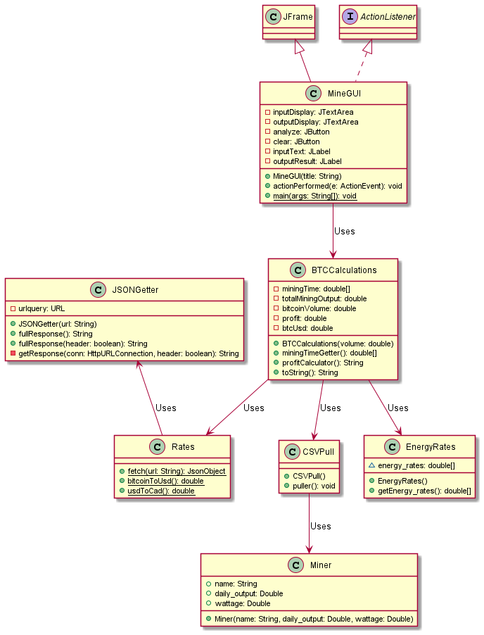

# HYL Project

## Authors

[Bhavyai Gupta](https://github.com/zbhavyai)

[Hamza Luqman](https://github.com/hamzaluqman)

[Greg Slowski](https://github.com/gslowski)

[Michael Lee](https://github.com/mlee2021)

## About

Calculates the amount of profits per hour of each mining rig and the time required to get the amount of Bitcoins entered by the user.

## Dependencies

+ JDK 1.7 or above

+ Maven 3.6.3 or above

## UML Diagram

