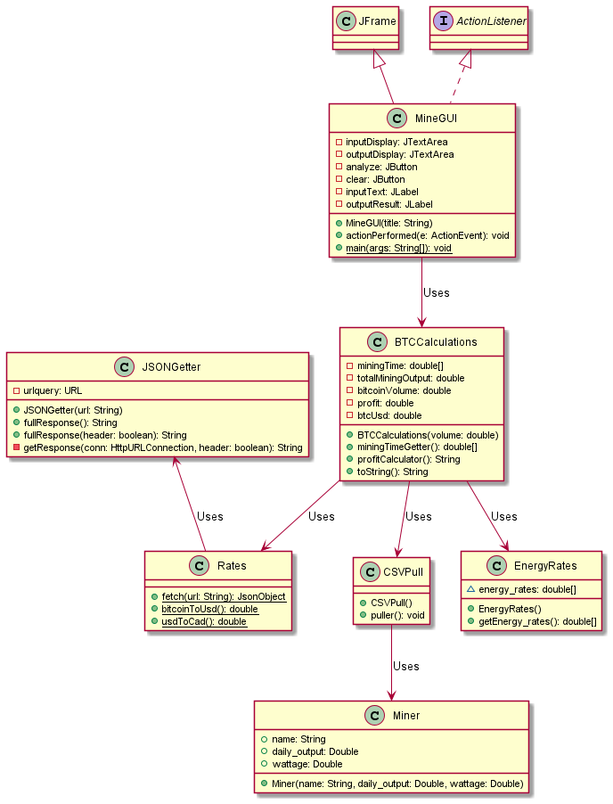

# Crypto Mining - HYL Summer 2021

An app to calculate profit per hour of each mining rig and the time required to get the specified amount of Bitcoins. The Bitcoin to USD exchange rate is taken from the **Coindesk API**. The power consumption, energy rate, and hashrate of each miner is taken from supplied CSV files.

The project was the runner up in the HYL Summer 2021 Hackathon.

## Project Sturcture

- [Problem Set](Documents/03_Problem_Set.pdf) - the problem set document
- [MiningSetup.csv](MiningSetup.csv) - contains hashrate and wattage of mining rigs
- [EnergyRates.csv](EnergyRates.csv) - contains the energy rates
- [src](src) - contains all the source code

## Dependencies

- JDK 11 or above
- Maven 3.6.3 or above

## How to run

1. Clone the repository on your machine

2. Run the below command from the repository's root directory to launch the GUI

   ```bash
   $ mvn exec:java -Dexec.mainClass="ca.hackyourlearning.MineGUI"
   ```

## UML Diagram



## Contributors

- [Bhavyai Gupta](https://github.com/zbhavyai)
- [Greg Slowski](https://github.com/gslowski)
- [Hamza Luqman](https://github.com/hamzaluqman)
- [Michael Man Yin Lee](https://github.com/mlee2021)
